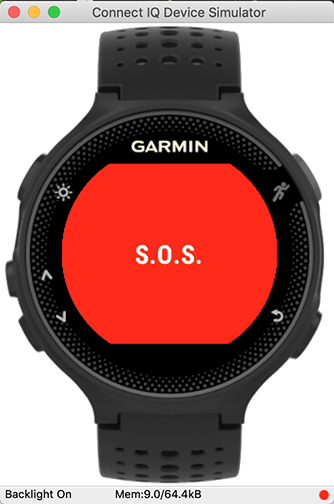

# SOS-now

## Description

This is a sample app based on the ConnectIQ tutorial serving some real purpose:

Morse an `S.O.S` signal via the backlight and the attention tones.

## How to run

Use the Eclipse ConnectIQ perspective

